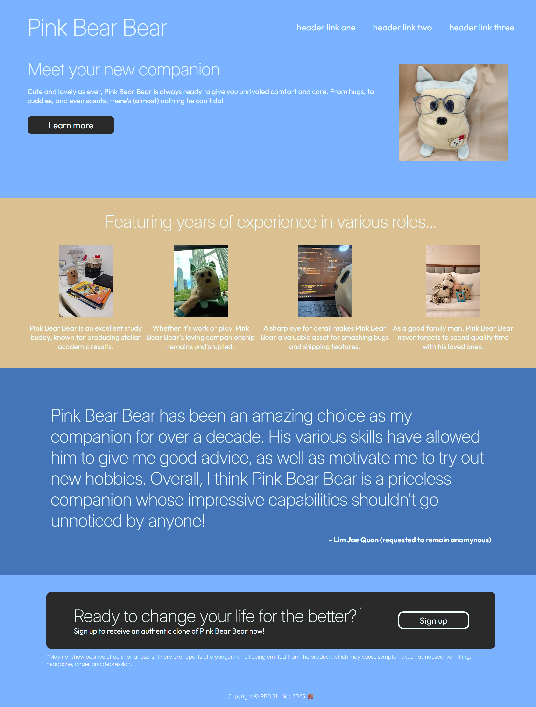

# landing-page
Landing page project based on The Odin Project curriculum.

Live demo link: https://j0e-quan.github.io/landing-page/

## Technologies used:
 - HTML for basic page layout
 - CSS for styling and organisation with Flexbox
 - Self-hosted fonts (Inter for headings, Outfit for body text)
 - Git for version control

## Key features:
 - Beautiful layout organised with Flexbox
 - Custom fonts enhance appearance and readability
 - Use of images and (non-functional) button elements

## Credits:
 - All pictures used were my own photos

 ## Gallery:
 